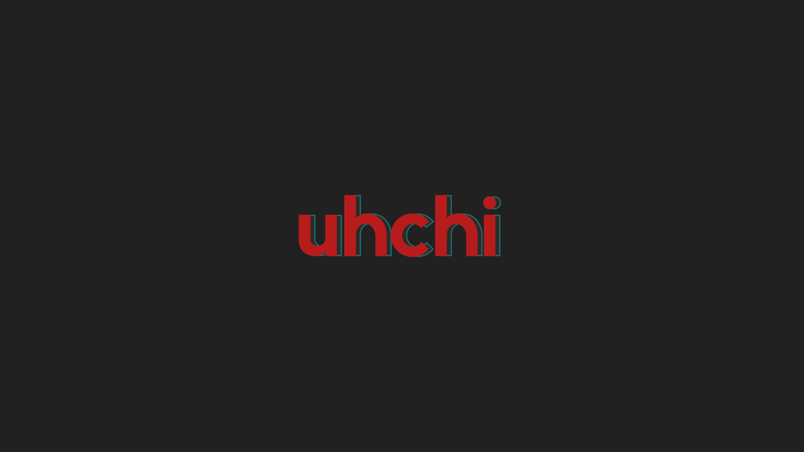

# Design Notes

The uhchi GUI direction for Corvus is based on:

- Dark graphite: `#2D2D2D`
- Red foreground: `#CC2936`
- Darker teal outline or offset shadow: `#1F7F78`
- Slightly lighter graphite backing letter: `#383838`

Reference image:

The current shell stores these values as CSS tokens in `frontend/src/app/globals.css`.
The wordmark should use red foreground letters over a slightly lighter graphite
backing letter with the darker teal as an outline, not as a filled block shadow.
Supporting type should use a smooth rounded system stack, heavy weights, and
rounded controls. Phase 5 should apply the same direction to the real dashboard
while keeping performance thresholds visibly labeled as directional defaults.

## V1 Motion

The interface should feel smooth and calm:

- one entrance motion per surface
- warm off-white accents, not sterile white
- no placeholder or coming-soon panels
- no motion that hides data or blocks interaction
- `prefers-reduced-motion` support on every animated surface

## Help Copy

About and help surfaces should be terse and technical. They should explain:

- what SQL computed
- which rows support the result
- where the check fits in the workflow
- when a technician should inspect the vehicle

Avoid filler, tutorials, and marketing copy.
